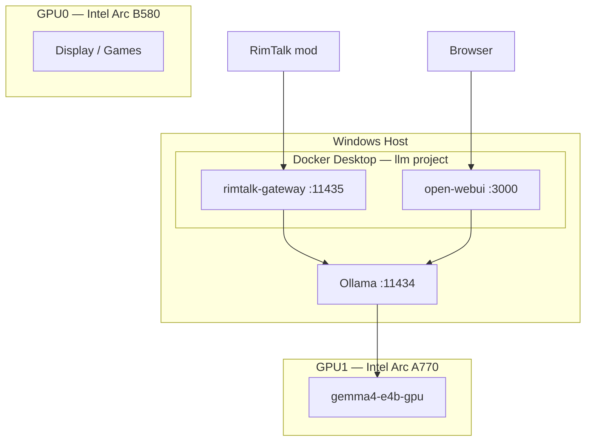

# RimWorld Local LLM Stack

Gemma 4 on **Intel Arc A770** (LLM) + **B580** (display), with **Open WebUI** and a **RimTalk gateway** that injects `reasoning_effort: "none"` for fast in-game dialogue.

Configuration and scripts only — model weights via `ollama pull` (~9.6GB for `gemma4:e4b`).

## Architecture



| Component | URL |
|-----------|-----|
| RimTalk API | `http://127.0.0.1:11435/v1` |
| Ollama API | `http://127.0.0.1:11434/v1` |
| Open WebUI | `http://localhost:3000` |

---

## When to use what

| Goal | Command |
|------|---------|
| Boot everything (manual) | `.\scripts\startup.ps1` |
| Register login autostart | `.\scripts\startup.ps1 -Register` |
| Ollama GPU only | `.\scripts\start-ollama-gpu.ps1` |
| Benchmark TPS | `.\scripts\measure-tps.ps1` |
| Stop Docker stack | `docker compose -p llm down` (from parent `D:\llm`) |

When this repo lives inside `D:\llm`, `startup.ps1` uses the parent `docker-compose.yml` (`name: llm`). Standalone clone uses this repo's `docker-compose.yml`.

---

## Script quick start

### `scripts/startup.ps1` — main entry

Starts host Ollama (A770 Vulkan) + Docker stack (Open WebUI + gateway). Handles Windows Startup registration.

```powershell
cd <repo>\scripts

.\startup.ps1                    # full stack
.\startup.ps1 -SkipWarmup        # model already loaded on GPU
.\startup.ps1 -SkipOllama        # Docker only

.\startup.ps1 -Register          # autostart on login
.\startup.ps1 -Unregister
.\startup.ps1 -Status            # registration + boot log
```

Boot log: `%LOCALAPPDATA%\LLM-Stack\boot.log`

### `scripts/Start-LlmStack.ps1` — stack core

Called by `startup.ps1`. Usually not run directly.

```powershell
.\Start-LlmStack.ps1
.\Start-LlmStack.ps1 -SkipWarmup
```

### `scripts/start-ollama-gpu.ps1` — Ollama GPU only

```powershell
.\start-ollama-gpu.ps1
ollama ps    # expect 100% GPU
```

### `scripts/start-docker.ps1` / `scripts/start-rimtalk-gateway.ps1`

Aliases for `startup.ps1` (no separate Docker project).

```powershell
.\start-docker.ps1
.\start-rimtalk-gateway.ps1
```

### `scripts/measure-tps.ps1` — throughput benchmark

```powershell
.\measure-tps.ps1
.\measure-tps.ps1 -Model gemma4-e4b-gpu -Runs 5 -SkipWarmup
```

### `scripts/Set-LlmGpuEnv.ps1` — GPU env helpers

Dot-sourced by other scripts. Sets `OLLAMA_VULKAN=1`, `GGML_VK_VISIBLE_DEVICES=1`, `OLLAMA_HOST=0.0.0.0:11434`.

---

## RimTalk settings

| Setting | Value |
|---------|-------|
| API Base URL | `http://127.0.0.1:11435/v1` |
| API Key | any string |
| Model | `gemma4-e4b-gpu` |

---

## Repository layout

```
.
├── config/rimtalk-gateway.json
├── modelfiles/
├── rimtalk-gateway/          # gateway Docker image (gateway.py)
├── scripts/
│   ├── startup.ps1           # ← start here
│   ├── Start-LlmStack.ps1
│   ├── start-ollama-gpu.ps1
│   └── measure-tps.ps1
├── docs/
└── docker-compose.yml        # used when repo is standalone
```

Parent install (`D:\llm`): use `D:\llm\docker-compose.yml` with `name: llm`.

---

## Documentation

- [Getting started](docs/getting-started.md)
- [Configuration](docs/configuration.md)
- [Intel Arc dual GPU](docs/intel-arc-dual-gpu.md)

## License

Scripts: use freely. Gemma 4 weights: [Google Gemma license](https://ai.google.dev/gemma/terms).

---

# 림월드용 로컬 LLM 스택

Gemma 4 + Open WebUI + RimTalk 게이트웨이(`reasoning_effort: "none"` 자동 주입) 구성입니다.

## 상황별 한 줄 요약

| 하고 싶은 것 | 명령 |
|--------------|------|
| 전체 수동 기동 | `.\scripts\startup.ps1` |
| 로그인 시 자동 기동 등록 | `.\scripts\startup.ps1 -Register` |
| Ollama만 GPU 재시작 | `.\scripts\start-ollama-gpu.ps1` |
| 속도 측정 | `.\scripts\measure-tps.ps1` |
| Docker 중지 | `docker compose -p llm down` (`D:\llm`에서) |

---

## 스크립트별 빠른 시작

### `scripts/startup.ps1` — 메인 진입점

호스트 Ollama(A770) + Docker(llm) 통합 기동 · Windows 시작 프로그램 등록.

```powershell
cd D:\llm\rimtalk-gateway\scripts

.\startup.ps1                    # 전체 기동
.\startup.ps1 -SkipWarmup        # 워밍업 생략
.\startup.ps1 -SkipOllama        # Docker만

.\startup.ps1 -Register          # 로그인 자동 기동
.\startup.ps1 -Unregister
.\startup.ps1 -Status
```

부트 로그: `%LOCALAPPDATA%\LLM-Stack\boot.log`

### `scripts/Start-LlmStack.ps1` — 스택 코어

`startup.ps1`이 내부 호출. 직접 실행도 가능.

```powershell
.\Start-LlmStack.ps1 -SkipWarmup
```

### `scripts/start-ollama-gpu.ps1` — Ollama GPU만

```powershell
.\start-ollama-gpu.ps1
ollama ps    # 100% GPU
```

### `scripts/start-docker.ps1` · `scripts/start-rimtalk-gateway.ps1`

`startup.ps1` 별칭 (파편화된 Docker 프로젝트 생성 안 함).

```powershell
.\start-docker.ps1
```

### `scripts/measure-tps.ps1` — TPS 측정

```powershell
.\measure-tps.ps1 -Model gemma4-e4b-gpu
```

### `scripts/Set-LlmGpuEnv.ps1` — GPU 환경 변수

다른 스크립트에서 dot-source. 직접 실행 불필요.

---

## RimTalk 설정

| 항목 | 값 |
|------|-----|
| API | `http://127.0.0.1:11435/v1` |
| 모델 | `gemma4-e4b-gpu` |

## 문서

- [Getting started](docs/getting-started.md)
- [Configuration](docs/configuration.md)
- [Intel Arc dual GPU](docs/intel-arc-dual-gpu.md)
